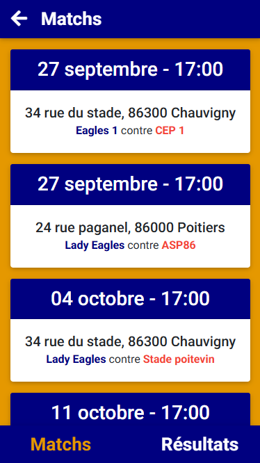
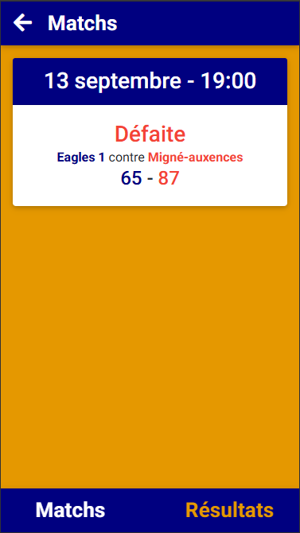
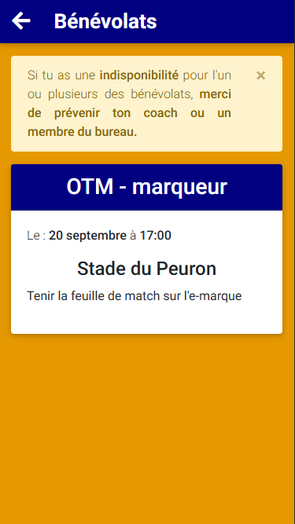

# Projet USCBB
Ce projet est une demande du club de basket de Chauvigny afin de faciliter la communication au sein du club.

J'étais le seul développeur sur ce projet. J'ai réalisé ce projet en tant que service civique durant ma licence pro (2020/2021).

## L'application utilisateur
Le projet est divisé en deux parties, la première est cette application orientée mobile pour fournir un accès aux informations.

Un utilisateur sans compte doit pouvoir voir :
    - Les prochains matchs
    - Les résultats
    - Les futurs évènements du club
    - Les messages d'informations du bureau

Un utilisateur avec un compte (le compte est créé par l'administrateur cf. la partie admin) doit pouvoir voir :
    - Les numéros de téléphone des joueurs de son équipe
    - Les bénévolats qu'il doit faire (dans un match on a obligatoirement besoin de 3 bénévoles, 2 OTM et 1 responsable de salle)

L'application est en lecture seule même si l'administrateur se connecte.

. Mais le design du projet FuturoVTC s'inspire beaucoup de cette application (en gardant les couleurs de l'application)

## Partie bonus
En plus d'avoir codé ce projet et pour les besoins de ce projet j'ai mis en place un serveur OVH avec un nom de domaine pour avoir aussi des adresses mails personnalisées pour le club.

## État du projet
### Déroulement du développement
Au début mon objectif était d'utiliser une techno qui me permet d'avoir un code que je peux compiler pour Android et IOS, j'ai cherché et essayé quelques solutions comme Xamarin, Cordova ou ReactNative. J'avais aussi pensé à Lumen (Laravel en API seulement avant qu'ils regroupent tout en un) pour une gestion plus simple des requêtes.

Apprendre un nouvelle techno tout en réalisant le projet dans les temps était trop compliqué pour moi à l'époque je me suis tourné vers une filouterie, faire un site web et faire une simple web view dans l'application. Laravel à donc été retenu pour le web et l'application a été faite avec Android Studio.

### Finalité
A l'été 2021, j'ai fourni au club : 
    - Une application disponible sur le Google Play Store
    - Un site web pour administrer les données
    - Un serveur OVH avec un nom de domaine
    - Des adresses mails

Ce qu'il manquait :
    - Une application disponible sur IOS
    - Un système de notification

Pour plusieurs raisons (les adhérents n'utilisant pas l'application par exemple...), l'application n'a pas été poursuivit après la saison 2021/2022.
Le serveur OVH et les adresses mails sont encore utilisés aujourd'hui.

## Remarques
Même si la finalité est décenvante pour moi, j'ai appris énormément de chose, surtout pour les relations client (compréhension et analyse des besoins du client, faire des rapports...).

Quand je regarde mon code aujourd'hui je me rend compte de mes erreurs dans la conception de base et aussi la façon de coder.
Si je devais refaire le projet, je pense qu'un "simple" serveur Discord serait beaucoup plus indiqué qu'une application personnalisée (avec toutes les fonctionnalitées qu'ils ont intégrés au fil du temps)
